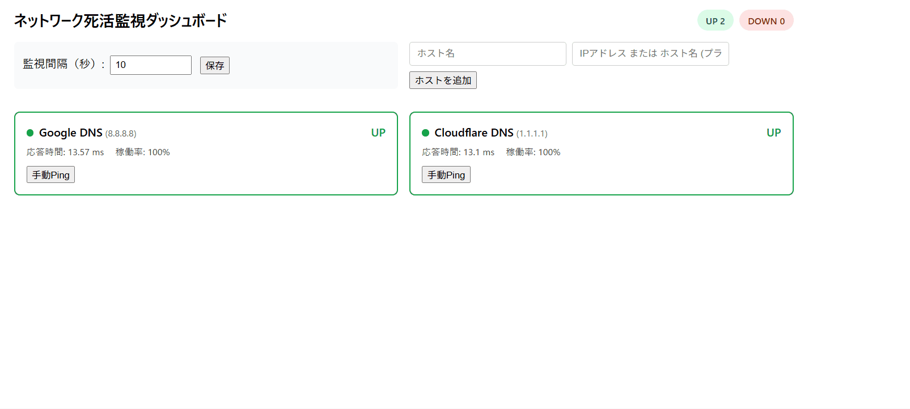
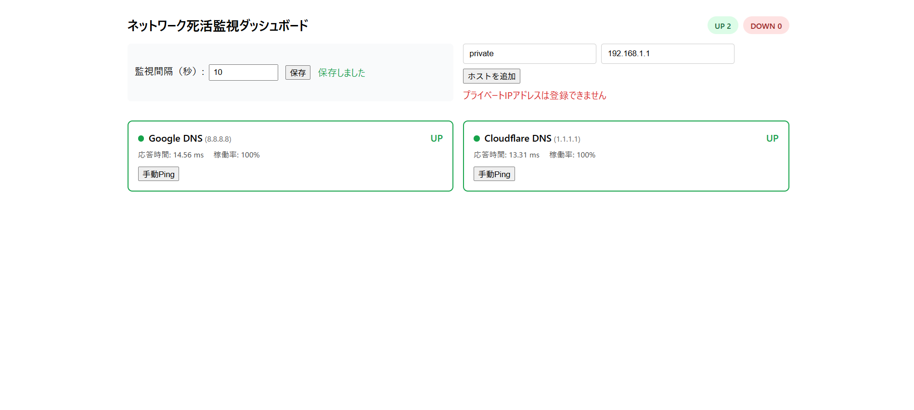

# ネットワーク死活監視ダッシュボード

複数のホスト（IPアドレス/ホスト名）に対して定期的にpingを実行し、UP/DOWNステータス・応答時間・稼働率をダッシュボードで可視化するアプリケーションです。

## 構成

- **Backend**: Python 3.11 / FastAPI / SQLAlchemy / SQLite / ping3 / APScheduler
- **Frontend**: React 18 / Vite / Recharts / Axios
- **Deploy**: Render（バックエンド・フロントエンド分離構成）

## ディレクトリ構成

```
network-monitor/
├── backend/        FastAPIアプリケーション
└── frontend/       Reactアプリケーション
```

## セットアップ

### バックエンド

```bash
cd backend
python -m venv .venv
.venv\Scripts\activate   # Windows
pip install -r requirements.txt
copy .env.example .env
uvicorn app.main:app --reload
```

起動後、`http://localhost:8000/health` でヘルスチェックができます。
`DEBUG=true` の場合のみ `http://localhost:8000/docs` でSwagger UIにアクセスできます。

### フロントエンド

```bash
cd frontend
npm install
copy .env.example .env
npm run dev
```

`http://localhost:5173` でダッシュボードにアクセスできます。

## 環境変数

### backend/.env

| 変数名 | 説明 | デフォルト |
|---|---|---|
| `DEBUG` | デバッグモード（trueでSwagger UI公開） | `false` |
| `DATABASE_URL` | SQLAlchemy接続文字列 | `sqlite:///./network_monitor.db` |
| `ALLOWED_ORIGINS` | CORS許可オリジン（カンマ区切り） | `http://localhost:5173` |
| `DEFAULT_PING_INTERVAL_SECONDS` | デフォルト監視間隔（秒） | `60` |
| `MIN_PING_INTERVAL_SECONDS` | 監視間隔の最小値 | `10` |
| `MAX_PING_INTERVAL_SECONDS` | 監視間隔の最大値 | `3600` |
| `HISTORY_RETENTION_HOURS` | 履歴データの保持時間 | `24` |
| `PING_TIMEOUT_SECONDS` | ping1回あたりのタイムアウト | `2.0` |

### frontend/.env

| 変数名 | 説明 | デフォルト |
|---|---|---|
| `VITE_API_BASE_URL` | バックエンドAPIのベースURL | `http://localhost:8000` |

## セキュリティ対策

- **プライベートIPブロック**: `10.x`, `172.16-31.x`, `192.168.x`, `127.x`, `169.254.x` のIPアドレス、およびそれらに解決されるホスト名は登録・pingの対象から拒否されます（バックエンド: `app/core/security.py`、フロントエンド: `src/utils/validators.js` で二重にチェック）。
- **入力バリデーション**: Pydanticスキーマで全APIリクエストの形式・範囲をチェックします。
- **SQLインジェクション対策**: SQLAlchemy ORMのみを使用し、生SQLは記述していません。
- **コマンドインジェクション対策**: subprocessフォールバック時もping対象を厳格な許可文字パターンで再検証してから実行します。
- **セキュリティヘッダー**: `X-Content-Type-Options`, `X-Frame-Options`, `Content-Security-Policy` などをmiddlewareで全レスポンスに付与します。
- **CORS制御**: 許可オリジンは環境変数 `ALLOWED_ORIGINS` で管理し、ワイルドカードを使用しません。
- **XSS対策**: フロントエンドはReactの自動エスケープに加え、ホスト名はバックエンド側でもHTMLエスケープして保存します。

## API一覧

| メソッド | パス | 説明 |
|---|---|---|
| GET | `/api/hosts` | ホスト一覧＋最新ステータス取得 |
| POST | `/api/hosts` | ホスト追加 |
| DELETE | `/api/hosts/{id}` | ホスト削除 |
| GET | `/api/hosts/{id}/metrics` | 応答時間履歴取得（直近24時間） |
| POST | `/api/hosts/{id}/ping` | 手動ping実行 |
| GET | `/api/settings` | 監視設定取得 |
| PUT | `/api/settings` | 監視設定更新 |
| GET | `/health` | ヘルスチェック |

## Renderへのデプロイ

`backend/render.yaml` を使用してバックエンドをWeb Serviceとしてデプロイできます。フロントエンドはStatic Siteとして別途デプロイし、`VITE_API_BASE_URL` にバックエンドのURLを設定してください。バックエンド側の `ALLOWED_ORIGINS` にはフロントエンドの本番URLを設定してください。

## 📺 デモ


## 🖼 スクリーンショット


## 主な機能

- 複数ホストへの定期ping監視（10〜3600秒で間隔設定可能）
- UP/DOWNステータスのリアルタイム表示（30秒ごとにポーリング）
- DOWN検知時のアラートバナー表示
- 過去24時間の応答時間グラフ（Recharts）
- 稼働率（%）の表示
- 手動ping実行
- ping3が利用できない環境ではsubprocess（pingコマンド）にフォールバック
- 履歴データは直近24時間分のみ保持し、古いデータは自動削除
